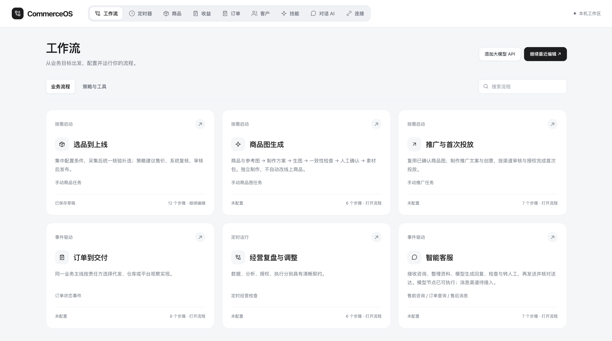
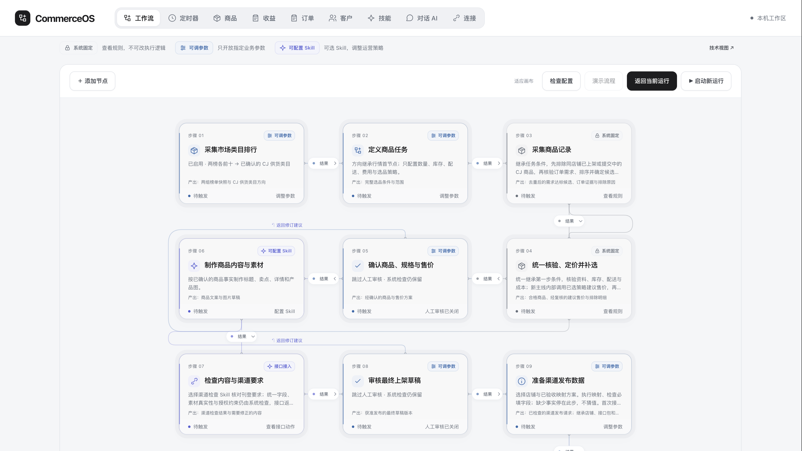
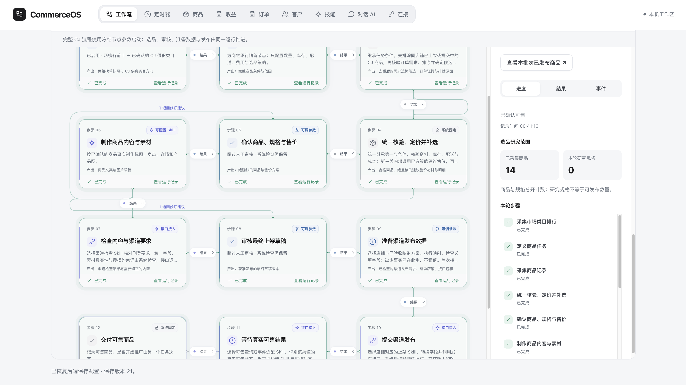

<div align="center">

# CartWeave

### 把跨境电商运营，编织成看得懂、能执行的工作流。

**一个可自托管的电商自动化工作台：业务流程 × 可插拔策略 × 受控 AI。**

Next.js · Django REST Framework · Pydantic · Pi Agent Core

[界面预览](#界面预览) · [业务版图](#不止选品六类业务流程一个工作台) · [快速开始](#快速开始) · [技术亮点](#不只是一个-ai-节点编辑器) · [路线图](#路线图)

</div>

<p align="center">
  <strong>选品上线 &nbsp; · &nbsp; 商品素材 &nbsp; · &nbsp; 推广 &nbsp; · &nbsp; 订单 &nbsp; · &nbsp; 经营复盘 &nbsp; · &nbsp; 智能客服</strong>
</p>

---

> **平台方向：** 覆盖商品、内容、营销、订单与客服的跨境电商工作流。**当前完整执行闭环：** CJ 选品 → 本地独立站发布 → 可售确认；另已接入业务只读同步、流程调度及模型会话。其余模板逐步接入，不执行采购付款、物流发货或广告投放。

## 为什么做 CartWeave？

电商运营不是一条永远从选品开始的流水线：新品上线可能偶尔才做一次，已售商品的订单、客服和经营检查却需要持续处理。商品图可以单独制作，推广应复用确认过的素材，店铺接入也不应在每个流程里重复配置。

CartWeave 按**业务触发与结果**组织流程，而不是按技术组件堆节点。运营调整条件和策略，平台负责固定契约、核验、版本、授权与执行记录；不同渠道的接口差异由经审核的适配层承接。

**需要理解和生成的地方用 AI，需要稳定和可验证的地方用代码。** 模型处理接口语义分析、客服回复与商品图方案；日常选品、计算和发布复用确定性规则及适配代码。缺少事实就停下来，不让模型编库存、运费或必填值。

适合想研究跨境电商自动化的开发者、希望把脚本整理成业务流程的小团队，以及需要自托管运营工具的人。当前是持续迭代的早期项目，不是开箱即用的生产 ERP。

## 界面预览

### 从业务目标进入，而不是从空白画布开始



选品上线、商品图、推广、订单、复盘和客服有各自入口；它们不是必须依次执行的六个阶段。截图展示当前界面，不表示每个模板都已具备完整后端执行器。

### 运营可调策略，系统守住执行边界



同一画布配置业务参数和策略，区分「系统固定」「可调参数」「可配置 Skill」。店铺接入集中保存，后续节点继承对应连接与接口包；不是每个节点都要重新接一遍。

### 配置画布也是执行画布



节点、连线和侧栏共同呈现运行状态；进度、结果和事件取自服务端。可返回编辑后重新打开同一运行，不把页面刷新当成启动新任务。截图中的数量仅是该次界面记录，不是性能基准或收益承诺。界面保留 CommerceOS 名称，开源项目名为 CartWeave。

## 不止选品：六类业务流程，一个工作台

| 业务流程 | 给运营解决什么问题 | 当前进度 |
| --- | --- | --- |
| **选品到上线** | 找到需求候选，核验供货、算价、整理内容，发布并确认可售 | CJ → 本地测试站完整闭环已实现 |
| **商品图生成** | 独立制作与确认素材包，不直接改线上商品 | 六步模板；模型可生成制作方案，图像执行器待接入 |
| **推广与首次投放** | 复用已确认素材，制作创意、检查渠道要求并授权投放 | 七步模板；广告平台执行器待接入 |
| **订单到交付** | 按店铺与履约方式处理订单、跟踪交付 | 模板与订单只读同步已具备；采购、付款、发货未执行 |
| **经营复盘与调整** | 读取经营数据，分析并确认调整策略 | 模板与财务只读同步已具备；自动调整待接入 |
| **智能客服** | 收集问题与依据，生成回复，检查并转人工 | Pi 模型回复草稿可执行；收信、查单、发送与送达未接入 |

这些流程共用商品、订单、客户、收益、技能、模型连接及店铺接口；**共用连接不等于自动取得所有动作权限**。完整流程可否冻结和运行，由后端按已实现能力校验，不能把能画出来等同于能执行。

### 三种扩展能力，各做各的事

- **接入开发规则**：指导编程 AI 给自建站补 API、分析现有接口与固定字段的对应关系；开发分析不等于接口已经安装。
- **业务 Skill / 接口包**：经审核、版本化的策略与适配代码，日常执行复用；同一个店铺包可以覆盖多个已验收动作，不需反复配置相似 Skill。
- **运行时模型策略**：经官方 Pi Agent Core 执行对话、客服回复与图像制作方案，输出再接受 Pydantic 校验；不开放 Shell 或任意工具。

模型连接支持 OpenAI Chat 兼容、Responses、Anthropic Messages、Gemini 四类协议。协议支持不代表所有供应商或模型都已验收；确定性节点不会因为加入 AI 层而改成每轮问模型。

## 已跑通的第一条主线：选品到上线

### 1. 定义你要找什么，而不是反复配置每个节点

输入搜索词，例如 `hat`，集中设置目标市场、最终商品数、候选研究额度、库存、时效与费用假设。后续节点继承同一份任务参数。可选的行情首节点读取 CJ 销售与广告两组类目前十，确认方向与供货目录的对应关系后再采集。

### 2. 先看需求，再花时间研究供货

CJ 商品订单数门槛前置；重复商品、低订单商品及目标店铺已上架或发布中的商品不占新任务的需求达标额度。目录分页和详情研究有持久化进度，读取数量与达标数量分别展示。

### 3. 用同一份事实完成库存、配送与价格核验

完整商品详情在本轮复用，缺必要字段才补查。不把工厂报量冒充仓库现货，也不把缺失运费当零。研究完本轮冻结搜索范围后，对合格规格统一评分，按商品最佳合格规格选前 N 款；不足数量就明确说明原因，不凑数。

### 4. 每个排名都有理由，每个售价都有计算依据

内置已注册的确定性选品策略。当前 CJ v5 综合订单、刊登关注度、成本、时效与库存评分，权重为 **45% / 25% / 15% / 10% / 5%**，工厂供货另有扣分。

`orderCount` 的周期和国家范围未声明，不称为「目标市场近 90 天销量」。刊登次数只是关注度代理，不代表竞争商家数量。评分是透明启发式规则，尚无收益回测，不承诺畅销或盈利。详见 [算法说明](docs/cj-listing-opportunity.md)。

### 5. 准备好数据，然后才发送发布请求

默认内容整理复用原商品素材与文案，不要求每轮调用模型。商品与售价确认、最终草稿审核是独立步骤；本机模式可显式关闭审核，团队模式仍保留授权约束。

**准备渠道发布数据**执行已验收映射并检查必填字段，**提交渠道发布**继承它的店铺与接口包，发送请求并处理回执。准备阶段缺字段不能交给模型猜值；收到回执后还要查询可售状态。成功商品同步到商品模块，下架也经过同一受信店铺接口。

### 6. 离开页面，不等于停止业务

草稿由服务端保存，运行使用不可变冻结版本。执行画布展示实际节点状态、阶段耗时、排除原因和事件；可退出视图后返回、明确停止任务，或对支持的失败从原断点继续。连接、权限、证据、Skill 和幂等约束不会因恢复而被跳过。

## 不只是一个 AI 节点编辑器

| 设计 | 解决的问题 |
| --- | --- |
| **AI 适配，代码复用** | 首次接入分析接口语义；验收并注册适配代码后，日常动作复用代码，不给每个动作重复生成 Skill |
| **固定 / 参数 / Skill 三种边界** | 运营能直观看出哪些规则不能改、哪些参数能调、哪些策略能换；服务端独立校验，不靠 UI 限制授权 |
| **契约驱动的前后分层** | Pydantic 检查 HTTP 输入输出，业务规则检查语义与事实；同名字段不等于同一种业务含义 |
| **冻结设计，执行快照** | 编辑不会偷偷改变运行或定时器；包版本、节点描述版本和连接版本分别核对 |
| **批次研究与发布分离** | 研究完整范围后全池评分，只对最终清单确认和发布；每件商品保留独立幂等键与发布证据 |
| **安全边界内恢复** | 持久化游标、Outbox、任务租约和未知外部结果处理，避免把重试当成盲目重发 |
| **真实进度，而非动画进度** | 动效表达节点运行与数据传递；数量、暂停和成功均来自服务端，不随动画增长 |

这套通用化方向不是「所有平台的接口都一样」，而是 **稳定业务契约 + 经审核的平台适配层**。当前受信执行适配器是本地测试站；Amazon、Shopify 和更多渠道仍需要开发、验收与注册。

## 工作台里还有什么？

| 模块 | 当前能力 |
| --- | --- |
| 工作流 | 同画布配置、保存、校验冻结、真实运行、事件与失败反馈 |
| 商品图生成（设计阶段） | 独立六步：商品与参考图、制作方案、生图、检查、确认、素材包；推广与首次投放仍保持一条流程，生图与广告执行器待接入 |
| 冻结流程 | 只读快照、分页、可恢复删除；被活跃运行或启用定时器引用时禁止删除 |
| 定时器 | 对完整冻结流程安排每天、每周或小时间隔；上一轮未结束不补排重复任务 |
| 商品 | 发布结果投影、图片、店铺关联与真实接口下架 |
| 订单 / 客户 / 收益 | 共用已验收接口包，手动增量读取；游标持久化、重复同步不重复入账，缺成本不伪装完整利润 |
| 我的技能 | 两类接入规则、审核注册版本及制作草稿；草稿不等于可执行 Skill |
| 接口映射 | 支持 OpenAI Chat 兼容、Responses、Anthropic Messages、Gemini 四类协议；模型结果是待验收草案，不自动部署执行 |
| Pi 模型运行层 | 复用官方 Pi Agent 开源核心；对话与接口分析统一执行，Django 保留凭证、契约及业务授权，不开放 Shell 或任意工具 |
| 智能客服策略 | 真实模型回复草稿、事实依据、待补充问题及转人工标记；尚不查单、发消息或退款 |
| 商品图方案 | 模型输出提示词与商品真实性约束；尚未接图像服务或交付图片文件，不冒充完整生图流程 |
| CJ 行情扩展 | 普通 Chrome 登录后读取两张固定页面的可见榜单；不读取 Cookie、不绕过安全验证 |

测试站商品发布、下架和可售查询落实际数据库；结账、付款和物流展示仍是模拟，不产生真实订单或收益。订单 / 客户 / 财务只读能力可用，不代表订单履约主线已经完成。

## 快速开始

本机开发建议 Node.js 24（最低 22.19）、Python 3.12。需要自己的 CJ API 凭证才可真实选品；浏览前端、测试和研究代码不需要提供它。不要把密钥写入源文件。

```bash
git clone https://github.com/agentwinwinwin/CartWeave.git
cd CartWeave
npm ci
python3 -m venv server/.venv
server/.venv/bin/python -m pip install -r backend/requirements.lock
server/.venv/bin/python backend/scripts/configure_local.py

cd backend
COMMERCE_ENV=local ../server/.venv/bin/python manage.py migrate
COMMERCE_ENV=local ../server/.venv/bin/python manage.py bootstrap_local
COMMERCE_ENV=local COMMERCE_DESKTOP=1 ../server/.venv/bin/python manage.py register_opportunity_skill --cj-listings
cd ..

npm run build
npm run desktop
```

打开 [http://localhost:3000](http://localhost:3000)。本机启动器同时启动 Next.js、Django 与单个 worker，仅监听回环地址。这里的「desktop」是本机浏览器工作台，不是已打包的桌面安装程序。以上命令适用于 macOS / Linux；Windows 可使用 WSL。

首次使用：在连接页面安全填写并验证 CJ 密钥 → 在工作流中验收测试店铺接口 → 配置商品任务和策略 → 保存并冻结 → 在同画布运行。不会自动填写你的店铺、CJ 或模型密钥。

需要行情榜单时，在 Chrome 加载 [`browser-extension/cj-reader`](browser-extension/cj-reader)，正常登录 CJ，并按工作台引导配对；此能力不依赖 Codex。遇到登录过期、挑战或页面结构变化会停止，不隐匿自动化。

## 架构与代码导航

```text
Next.js 运营界面
  └─ 同源 /backend 代理（凭证留在服务端）
      └─ Django + DRF 模块化单体
          ├─ 工作流草稿 / 冻结版本 / 调度与运行
          ├─ 审批 / 注册 Skill / 审计 / 幂等操作
          ├─ CJ 只读采集与确定性选品
          ├─ 订单 / 客户投影与财务事实 / 增量同步
          ├─ 受控模型会话 → 官方 Pi Agent Core → 私有模型传输
          ├─ Pydantic 契约 + 受信店铺适配器
          └─ 独立测试站接口 → 发布 / 查询 / 下架 / 业务读取
```

- `app/`、`components/ui/`：路由、统一设计令牌与可复用组件。
- `components/commerce/workflow/`、`lib/workflow/`：画布、节点配置、设计文档与服务端客户端。
- `backend/apps/`：连接、技能、工作流、运行、审批、商品、财务与审计模块。
- `backend/contracts/`：运行与店铺 HTTP 契约。
- `public/integration-skills/`：生成独立站 API、接口字段映射的开发规则。
- `agent-runtime/` 与 `backend/apps/agents/`：Pi 模型生命周期和受控后端会话；运行策略与确定性业务 Skill 分开。详见 [Pi 接入边界](docs/pi-harness.md)。
- `browser-extension/cj-reader/`：范围受限的榜单读取扩展。

内部兼容标识仍使用 `commerceos.*`，这是契约与存储命名，不是另外一个项目。不会为了改名破坏已定义的接口版本。

进一步阅读：[后端架构](docs/backend-architecture.md) · [当前运行主线](docs/cj-launch-runtime.md) · [接口包业务同步](docs/store-business-sync.md) · [调度设计](docs/workflow-scheduling.md) · [项目讲解与演示提纲](docs/project-showcase.md)

## 测试

```bash
npm run test:workflow
npm run test:store
npm run test:skills
node --test scripts/test-pi-harness.mjs
node --test scripts/test-cj-extension.cjs

cd backend
COMMERCE_ENV=local ../server/.venv/bin/python manage.py test tests
```

回归使用合成数据、模拟外部接口与临时测试数据库，不代表所有真实渠道通过验收。浏览器脚本另需安装 Playwright；部分脚本会写入本机测试站，执行前阅读脚本说明，不对生产店铺运行。

## 路线图

- [x] CJ 到本地测试站的选品、核验、批次排名与发布闭环。
- [x] 冻结流程、真实执行视图、恢复/停止、业务定时器。
- [x] 订单 / 客户 / 财务只读接口包与同步模块。
- [x] 接口语义映射、注册版本和开发规则的分层。
- [x] 官方 Pi Agent Core 接入、模型连接管理与受控对话会话。
- [x] 智能客服结构化回复草稿、商品图制作方案；与确定性执行分层。
- [x] 六类业务模板、商品图与推广拆分、集中店铺接入与连接复用。
- [ ] 更多销售渠道的真实适配与语义验收样例。
- [ ] MySQL 迁移、按设备配置 worker 与生产多 worker 并发验证。
- [ ] 内容生成、素材生成执行器及可评估的策略回测。
- [ ] 订单到交付、客服消息渠道与广告业务主线；资金动作需单独设计安全边界。
- [ ] 更简单的安装、更新和跨平台桌面分发。

目前本机为 SQLite + 单 worker；PostgreSQL / Celery 的部署配置不等于生产并发已验证。Pydantic 不保证商业判断正确，自动化也不保证利润。请先在隔离测试环境验证自己的接口、权限与数据。

## 参与这个方向

我们尤其欢迎三类贡献：**真实接口的脱敏验收样例、可解释的选品策略、让运营看得懂的执行反馈**。提交 Issue 时说明场景与复现步骤，请勿附带密钥、客户数据或真实账单。[贡献指南](CONTRIBUTING.md) · [安全与隐私](SECURITY.md) · [版本记录](CHANGELOG.md)

如果你也希望 AI 电商自动化从「能演示」走向「有证据地执行」，欢迎 Star 关注后续版本。

## 许可证

项目代码采用 [MIT](LICENSE)。第三方字体与素材保留各自权利，不因代码许可证变成 MIT；见 [第三方说明](THIRD_PARTY_NOTICES.md)。开源副本不包含原使用者的密钥、数据库、客户或运行记录。
